<!-- Original inspiration from my 3 year old daughter who loves Micky Mouse. A google search of first JavaScript projects
repeatedly showed 'memory game'. I was able to envision my daughter enjoying playing a memory game with Micky Mouse characters  -->

<!-- Inspiration for description of Memory Game from [Ania Kubow](https://github.com/kubowania/memory-game.git) -->
# Micky-Mouse-Memory-Game

View [live site here](https://jwalshe86.github.io/Mickey-Mouse-Memory-Game/
)

The Mickey Mouse Memory game is a simple grid based game where the player has to flip over two
cards. If both cards match, then the player receives a score of one. These cards
are then removed from the game, leaving the player with the remainder of the cards
to flip over. The game is over when all the cards have been matched and there's no 
remaining cards to flip over.

<!-- Inspiration for rules of Memory Game from [Ania Kubow](https://github.com/kubowania/memory-game.git) -->
## Rules of Memory Game

- One card is flipped to start the game
- If the next card is identical, then you get +1 score
- These cards then disappear from the game
- If the next card you pick doesn't match, the cards flip back and remain in the game.
- The game continues until all the cards have been matched and have been removed.
- If you get 2 matches within 30 seconds you get 1 star 
- If you get 4 matches within 45 seconds you get 2 stars 
- If you get 6 matches within 60 seconds you get 3 stars & win the game!

## Contents

- [Micky-Mouse-Memory-Game](#micky-mouse-memory-game)
  - [Rules of Memory Game](#rules-of-memory-game)
  - [Contents](#contents)
- [User-Experience](#user-experience)
  - [As a new visitor](#as-a-new-visitor)
  - [As a returning visitor](#as-a-returning-visitor)
- [Design UXD](#design-uxd)
  - [Strategy](#strategy)
  - [Scope](#scope)
  - [Structure](#structure)
- [Technologies Used](#technologies-used)
  - [Languages Used](#languages-used)
  - [Frameworks, Libraries \& Programs Used](#frameworks-libraries--programs-used)
  - [Skeleton](#skeleton)
- [Wireframe](#wireframe)
  - [Surface](#surface)
    - [Colour Palette](#colour-palette)
  - [Typography](#typography)
    - [Imagery](#imagery)
    - [Iconography](#iconography)
    - [Accessability](#accessability)
- [Features](#features)
  - [Cards shake when matched](#cards-shake-when-matched)
  - [Hero Image](#hero-image)
  - [Bubbles when button pressed](#bubbles-when-button-pressed)
  - [Reviews](#reviews)
  - [Video](#video)
  - [Footer](#footer)
  - [Menu](#menu)
  - [Contact Us](#contact-us)
- [Testing](#testing)
  - [Validator Testing](#validator-testing)
- [User-Experience-Testing](#user-experience-testing)
  - [As a new visitor](#as-a-new-visitor-1)
  - [As a returning visitor](#as-a-returning-visitor-1)
  - [Bugs](#bugs)
- [Solved bugs](#solved-bugs)
- [Unfixed bugs](#unfixed-bugs)
- [Deployment](#deployment)
- [Final Product](#final-product)
  - [Laptop view](#laptop-view)
  - [Ipad view](#ipad-view)
  - [Mobile View](#mobile-view)
- [Credits](#credits)
  - [Content](#content)
  - [Media](#media)

# User-Experience

## As a new visitor
- As a child I want to have fun. 
- To have fun while also learning something valuable.
- I want to experience the magic of Disney

## As a returning visitor

I want to be able to measure my progress and try to beat my previous score. I'd like to see if I'm getting better at the game.

# Design UXD

## Strategy

Playing memory games may help with a child's cognitive development. Having fun is a positive incentive for children to learn. Mickey Mouse has a long history of entertainment when it comes to children. The aim was to use fun and the magic of disney to motivate children to play a memory game. 

## Scope

The scope covered the needs of 3+ year old children and their need for fun and memory development. The site is simple in it's layout - so it can be easily used by children. Customers can easily navigate the page and a pop up provides information on how to play the game. The main constraint was that only CSS, HTML and Javascript languages were used. 

## Structure

### Landing Page

- Hero Image with disney characters
- Left button which brings viewer to the game
- Right button which creates a pop up which explains how to play the game to the viewer

### Game Page

- Title prompt to explain to viewer all they need to do is click a card to start the game
- Information about how the viewer is doing regarding the game is held in a 'flag' above the game. This information covers the time, moves taken, stars gained and a reset icon.

### Congrats Popup

When the player completes the game a congrats pop up is shown with the viewers scores.

# Technologies Used

- Images compressed on [TinyPNG](https://tinypng.com/)
- Stars from [Font Awesome]("https://cdnjs.cloudflare.com/ajax/libs/animate.css/4.1.1/animate.min.css")
- Javascript validator [beautifytools](https://beautifytools.com/javascript-validator.php)
- Responsiveness check [Am-I-Responsive?](https://ui.dev/amiresponsive?)
- Lighthouse check on google chrome
- Hero Title from Google Fonts
- [Code Beautify](https://codebeautify.org/) was used to clean up the code alignment 

## Languages Used

Javascript, CSS & HTML.

## Skeleton

The premise was very simple a landing page and then the game page. The aim was to keep it simple as the target audience was young children. The use of a modal helped keep the layout clear.

## Surface

### Colour Palette

The hero image was chosen due to it containing many of the colorful Mickey Mouse characters which would be used in the game. The blue with the stars in the background is visually appealing. Night turns into day as the game is activated. The tropical trees and castle gives a feel of warmth and magic. The light blue in the flag matches the castle roof color here and creates a light atmosphere.

## Typography

The Mouse Memoirs font was chosen as the name fit with the theme and the comic style font suited the fun theme of the game. 

### Imagery 

- Mickey Mouse character images taken from [PNGWing](https://www.pngwing.com/).
- Images compressed on [TinyPNG](https://tinypng.com/).
- Disney logo sourced from [Disney UK](https://static-mh.content.disney.io/matterhorn/assets/logos/disney_logo_dark-baa807690db7.png);
- Background to images removed using [remove website](<https://www.remove.bg/>)
- Hero image was taken from [wallpapercave.com](https://wallpapercave.com/free-disney-backgrounds#google_vignette)

### Iconography

The Mickey Mouse favicon in the browser text was taken from [icons8](https://icons8.com/icons/set/mickey-mouse)

### Accessability

The WAVE accessabilty tool found [6-contrast-errors](./assets/images/readme-images/WAVE-results.png). However, the test here appears to be picking up previous versions of the game. A check of contrast using google dev tools found the contrasts were fine. There was one contrast issue with the green 'ok' button on the congrats modal. Chaning the background of the button here to black and the text to white addressed this. All the 'cards' have an alt text attribute. 4

# Features

## Hero Image

The Disney themed hero image was used to capture the fun and excitement of Disney. The aim was to get the viewer to further explore the page and play the game. 
  
  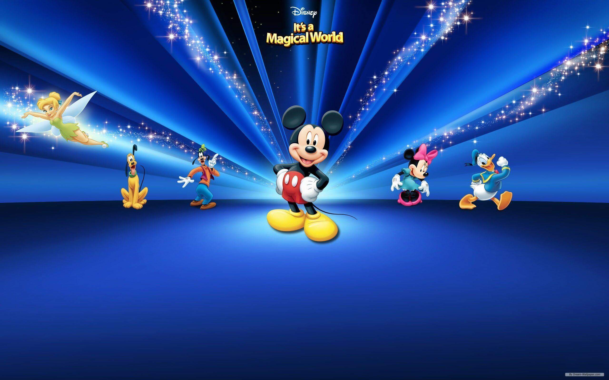

## Orientation Change Prompt

For smaller screensizes the user is prompted to turn the device from portrait to landscape

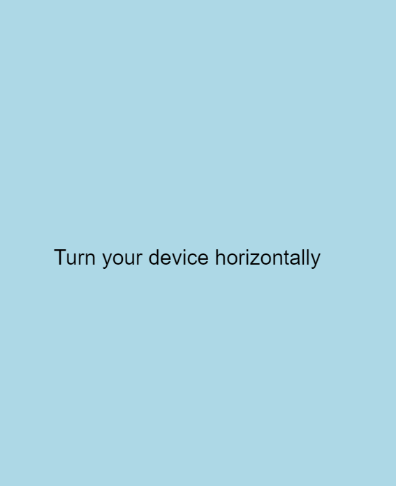

## How play modal

Upon pressing the 'How Play' button a modal pops up which tells the player how to play the game. A black overlay is also used to focus the users attention to the pop up.

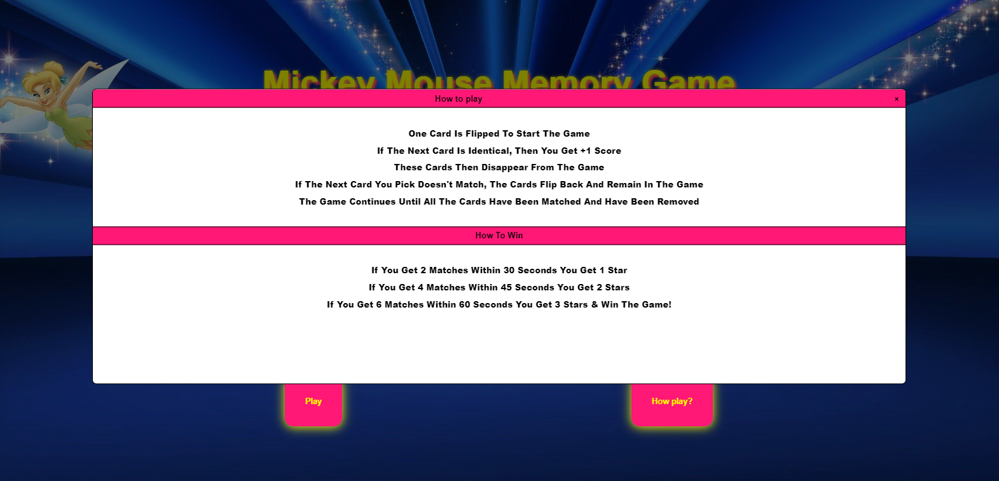

## Buttons Hover

The buttons change color when hovered over. This adds to the sense of interactivity with the page & shows the user they are in the correct place to click. 

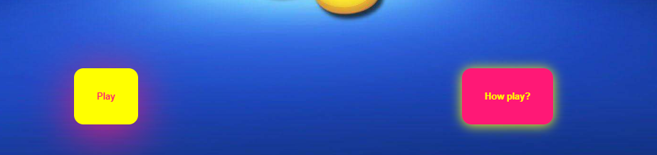

## Cards shake when matched

 This feature was imported from [Animate.css](https://animate.style/). This is to add to the sense of fun while playing the game. This was deemed particulary important as the game was targeted at young children.

## Stars when button pressed

- This again added to the element of fun, while playing. The code was adapted from [GreatStack](https://youtu.be/Odr24UQs3uY?feature=shared). Stars pop out of both the play and play how buttons when pressed. 
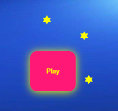

## Text Bounce

Using css.animates the click any card to begin text 'bounces' when the screen opens. This is to grab the viewers attention to this prompt when the game screen is loaded.

## Game Feedback

### Stars Scoring

- If a user gets two matches before 30s it gets one star, if it gets 6 matches before 45s it gets 2 stars & 3 stars before 60s gets 3 stars which is the top score. The stars on the screen are dimmed but if a user gains a star, a dimmed star lights up. 

### Timer

- The time starts at the beginning of the game and players can aim to get more stars in less time.

### Moves

The moves counter increases whenever a player tries another card. Getting 3 stars with the least amount of moves is another sign of progress. 

### Reset

The reset game button is displayed as a repeat icon. This looks pleasant and is easily accessible.

### Congrats Modal

When the game is completed a modal pops up congratulating the user. It also tells the user it's socre re stars, time and moves. A blue overlay is also present to focus the users attention on the pop up.

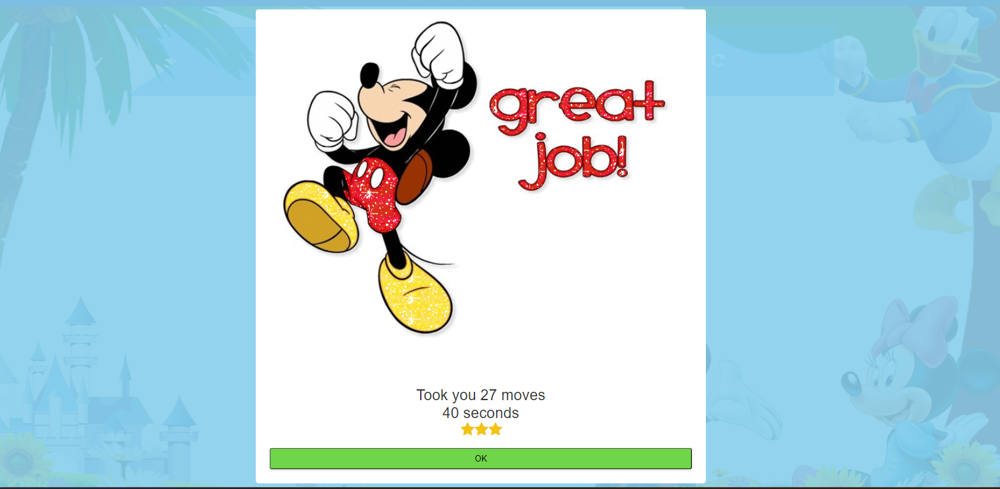

# Testing

## Validator Testing

### Javascript

Script tested using [beautifytools](https://beautifytools.com/javascript-validator.php) validator. [Result1](./assets/images/readme-images/js-errors1.png), [results2](./assets/images/readme-images/js-errors2.png,) [results3](./assets/images/readme-images/js-errors3.png). Several missed semi-colons and some functions and variables that were no longer in use but had not been deleted. After addressing the errors found [two-remained](./assets/images/readme-images/remaining-errors.png), The first one related to a destructuring assingment which was viewed as an expression. However this appears to work well with the code. The other one was modal not being defined. However, modal was being used as a keyword here not a variable, and in the context a definition wasn't required. 

### HTML

[HTML-W3C-Validator-Results](./HTML-W3C-Initial-Validator-Results.pdf) found 31 errors. The majority of the errors were having a /> where the / wasn't necessary. There were also two stray div's. Once these errors were addressed, a re-run of the validator found no errors. 

### CSS

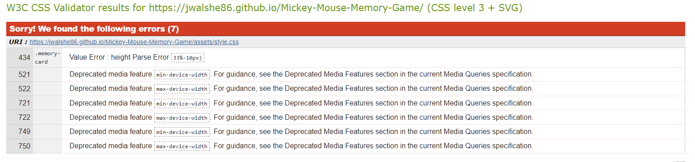 

### Page Performance

[Original-lighthouse-scores-for-load-page](./assets/images/readme-images/Original-lighthouse-loadpage.png). Two SEO issues 1. Document does not have a meta description. 2. Document doesn't use legible font sizes 20.5% legible text. [Lighthouse-scores-post-edits](./assets/images/readme-images/lighthouse-score-post-edits.png) were all nearly 100% once the font size in places was increased and the meta tag given more detail.

--------------

# User-Experience-Testing

## As a new visitor

- As a child I want to have fun. Achieved. My 3 year old daughter and 4 year old niece eagerly played the game and said it was very enjoyable. 

- To have fun while also learning something valuable. Achieved. Both children were able to show that they remembered where previous characters were and were subsequently able to complete the game. 

- I want to experience the magic of Disney. Achieved. Both children were able to name all the Disney characters and understood the concept presented.

## As a returning visitor

- I want to be able to measure my progress and try to beat my previous score. I'd like to see if I'm getting better at the game. Achieved. Viewers were eager to play the game again to beat their previous score and get 3 stars.

## Bugs

# Solved bugs

- One was able to select the div surrounding the span elements for the bubble but it would not store
in the variable 'howPlay'. When howPlay was logged it kept reading 'null'. When one tried the JS in
the html it worked. One researched this issue in [stackoverflow: Javascript only working when inside the html document](https://stackoverflow.com/questions/44160340/javascript-only-working-when-inside-the-html-document). On the final line of answers heres
someone mentioned ensuring both js files and html files were in the same document. When one did this the issue was resolved.
- The queryselector for the overlay was also selecting the classes for the bubble pop ups. This meant they bubbles wouldn't pop. It took some time to realise to specify the queryselector for the overlay, so it wouldn't interfere with the bubbles popping up. 
- The anchor tag for the play button would not wait until the bubble animation had finished. To delay the anchor link activating I found a solution on stackoverflow. This involved wrapping a setTimeout() around the {window.location = '#click-card'}
- After the 'tada' animation was introduced for when cards matched, the cards wouldn't stay unflipped. The solution involved creating an array to store the unflipped cards. Then targeting the elements in this array and adding a 'front1' class. Once this class was added the cards remained unflipped. Inspiration for this solution came from Susan Chen. However, how she designed her memory game was very different so I had to figure out a way to adapt her concept to my project.
- 3 font icon stars would not align in a row on the congrats display. The issue was you can't have the same names for a class in the one class element. To get around this one had to create a new class. However for the 3 stars the 3rd star only popped up when the card was clicked. So I had to add a card click, after the new class was created.
- Feedback from a colleague on slack Kera Cudmore highlighted how if one pressed the same card twice the counter increased. I was able to fix this by putting an if statement on the counter - ie the counter only increased if the same card was not pressed twice. 
- My custom error page didn't appear to show on the website despite following all the github instructions. I contacted Code Institute Tutor support and was informed that I was testing the error page incorrectly. To test the error page you put in an incorrect page name after the full website address - I was putting in an incorrect page name to early in the website domain name and was subsequently getting the github default error page.

# Deployment

The site was deployed on github pages from the outset. [Live site here](https://jwalshe86.github.io/Mickey-Mouse-Memory-Game/)

One clicked on settings within the Mickey Mouse Memory Game github repository. One pressed settings and went into the pages section. Under 'Build & Deployment' the source was branch. The branch was main and folder root. 

# Final Product 

## Laptop view

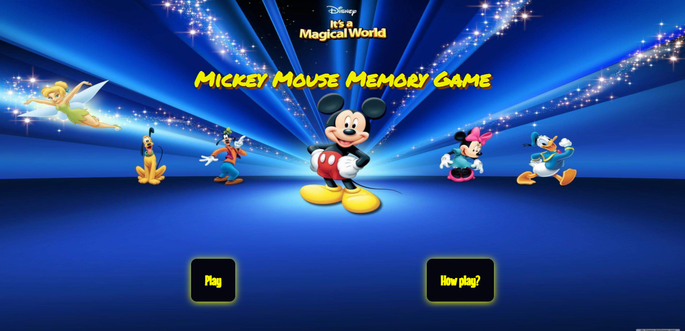
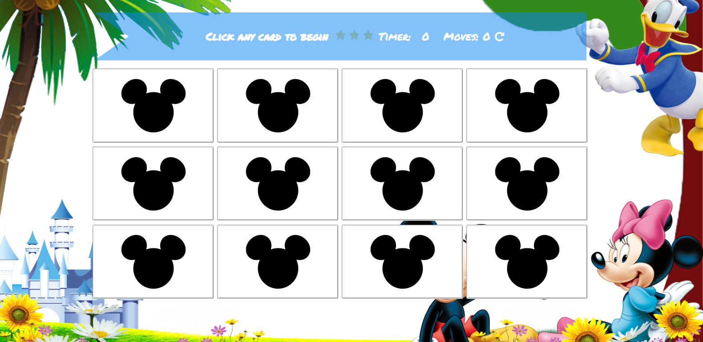

## Ipad view

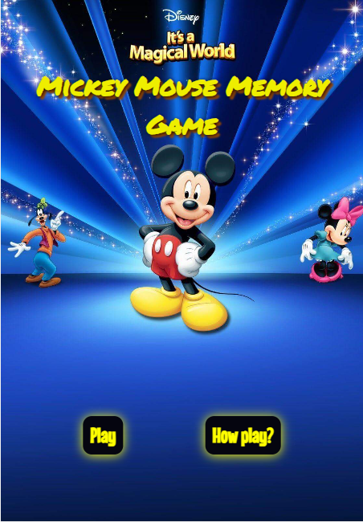
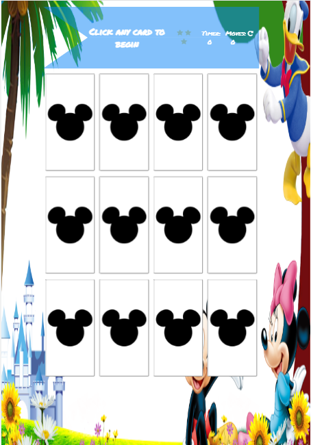

## Mobile View

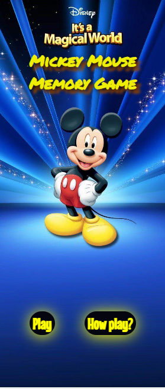
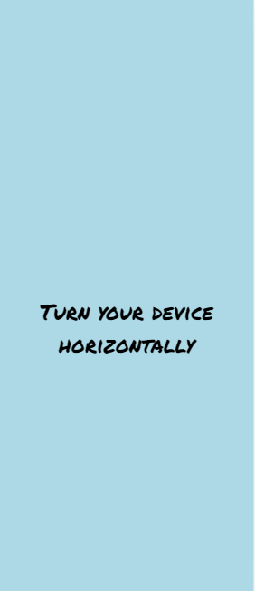
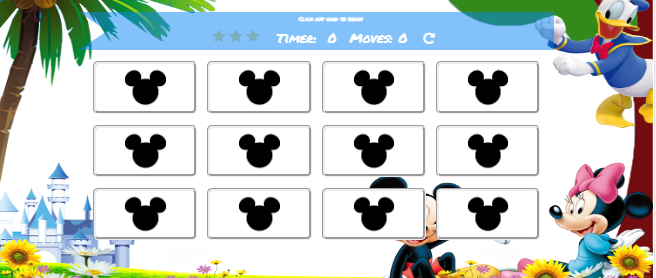

# Credits

- Inspiration for description of Memory Game from [Ania Kubow](https://github.com/kubowania/memory-game.git)
- Code for memory card game adapted from [Marina-Ferria](https://www.youtube.com/watch?v=ZniVgo8U7ek);
- Code for timer and counter adapted from [Moira Hartigan](https://github.com/moirahartigan/Portfolio-2---Alien-Memory-Game.git) & [Iris Smok](https://github.com/Iris-Smok/Kids-Memory-Game_PP2/blob/main/index.html)
- Getting the startTimer function to onlyrun once was taken from [Ankit Saxena](https://www.google.com/search?sca_esv=559732191&q=how+get+function+to+only+run+once+js&tbm=vid&source=lnms&sa=X&ved=2ahUKEwi0kKHpzfWAAxUlQEEAHVuqBH4Q0pQJegQIChAB&biw=1024&bih=493&dpr=1.88#fpstate=ive&vld=cid:29cb1a4c,vid:qZfK7Z75yUk)
 - Code adapted from [Cathy Dutton](https://codepen.io/cathydutton/pen/avYKeM) for timer presentation
- Code for how to play pop up modal adapted from [WebDevSimplified](https://youtu.be/MBaw_6cPmAw?feature=shared)
- Idea for score [itsourcecode](https://itsourcecode.com/free-projects/jsprojects/memory-game-in-javascript-with-source-code/?expand_article=1)
- idea for lives & dynamic card movement effect from [developedbyed](https://www.youtube.com/watch?v=-tlb4tv4mC4)
- styling of play & how to play buttons code adapted from [GreatStack](https://youtu.be/Odr24UQs3uY?feature=shared)
- code to delay anchor tag for play button until balloons pop taken from [nattik Gur-Arie](https://stackoverflow.com/questions/14434604/i-want-to-delay-a-link-for-a-period-of-500-with-javascript#:~:text=To%20delay%20a%20link%20with,it%20is%20inside%20the%20'%20'%20.)
- Code for cards shake when matched & stars & reset button adapted from [Susan Chen](https://susanschen.github.io/Memory-Game/) and the shake cards css was taken from [Animate.css](https://animate.style/)
- bubbles converted into stars using code adapted from [coding Artist](https: //www.youtube.com/watch?v=LZx_Hyudmdw)
- code to prompt user to flip device on smaller devices adapted from [Jarrod Whitley](https://stackoverflow.com/uestions/50766953/how-can-i-code-a-pop-up-text-box-that-only-appears-on-mobile-devices-when-the-sc)
- /* styling to shape the info div like a flag adapted from [Zoe Rooney](https://css-tricks.com/the-shapes-of-css/#Flag)
- feedback from mentor Anthony on first meet up to change overlay of congrats message to lighter colour & style the how to play modal: make it bigger
-     Add scroll behaviour to modal for smaller screensizes adapted from [stackoverflow](https://stackoverflow.com/questions/10476632/how-to-scroll-the-page-when-a-modal-dialog-is-longer-than-the-screen)
- Kera Cudmore for giving me feedback on the slack peer review channel.
- Allen Gleeson on Slack for prompting me to use a hover effect on the buttons.
- [draft.dev](https://draft.dev/learn/github-pages-404) for 404 error page template

